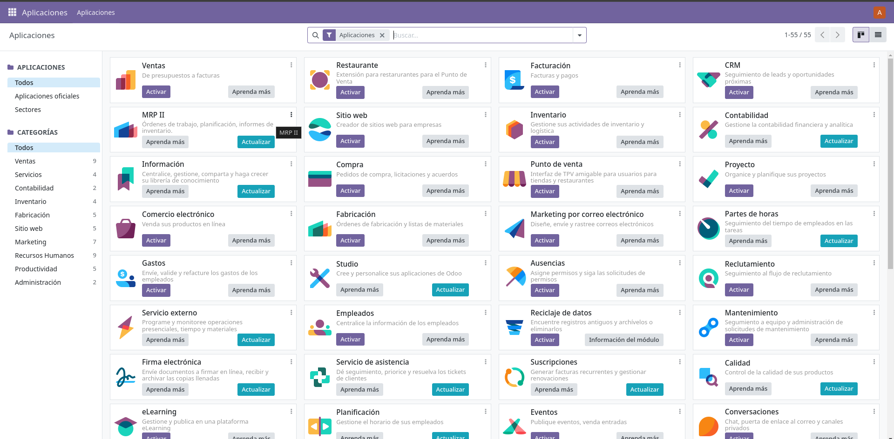

# Instalacion de Odoo mediante docker

### Requisitos
Tener instalado docker y docker-compose

### Pasos
1. Crear un archivo docker-compose.yml con el siguiente contenido:
```yml
services: 
  web: 
    image: odoo:17.0  # Usa la imagen de Docker "odoo" en su versión 17.0.
    depends_on: 
      - db  # El servicio "web" depende del servicio "db".
    ports: 
      - "8083:8069" 
  db:  
    image: postgres:15  # Usa la imagen de Docker "postgres" en su versión 15.
    environment:  # Define variables de entorno para el contenedor.
      - POSTGRES_DB=postgres
      - POSTGRES_PASSWORD=odoo  
      - POSTGRES_USER=odoo  
  pgadmin:
    image: dpage/pgadmin4  # Usa la imagen de Docker "dpage/pgadmin4".
    container_name: pgadmin4_container 
    restart: always 
    ports:  
      - "8888:80" 
    environment: 
      PGADMIN_DEFAULT_EMAIL: user-name@domain-name.com  # Email por defecto para pgAdmin.
      PGADMIN_DEFAULT_PASSWORD: strong-password  # Contraseña por defecto para pgAdmin.
    volumes:  
      - pgadmin-data:/var/lib/pgadmin 
volumes:  
  pgadmin-data: 
```

2. Ejecutar el siguiente comando para levantar los contenedores:
```bash
docker-compose up
```

3. Acceder a la url http://localhost:8083 para acceder a Odoo 
4. Creamos un usuario y contraseña para acceder a Odoo
   

  <p float="left">
    
    
  </p>

5. Acceder a la url http://localhost:8888 para acceder a pgadmin
6. Ingresar el correo y contraseña que se definio en el archivo docker-compose.yml
   
     <p float="left">
    
    
  </p>

7. Crear un nuevo servidor en pgadmin

- Primero cojeremos la ip de la maquina donde esta corriendo el contenedor de postgres
```bash
docker ps
```
- Buscamos el contenedor de postgres y copiamos la id
- Ejecutamos el siguiente comando
```bash
docker inspect id_del_contenedor
```
- Buscamos la ip en la seccion de "Networks"
- Creamos un nuevo servidor en pgadmin con la ip optenida

  <p float="left">
    
    
  </p>

  ## Preguntas Extra
  ### ¿Que ocurre si en el ordenador local el puerto 5432 está ocupado?
  Si el puerto 5432 esta ocupado, se puede cambiar el puerto en el archivo docker-compose.yml en la seccion de db ya que al estar ocupado no se podra levantar el contenedor de postgres

  ### ¿Y si lo estuviese el 8069? 
  Si el puerto 8069 esta ocupado, se puede cambiar el puerto en el archivo docker-compose.yml, pero solo es necesario en el que esta de los ":" ya que el otro es el puerto que se va a usar para acceder a Odoo y el que esta antes es el que usua nuestro dispositivo para acceder
